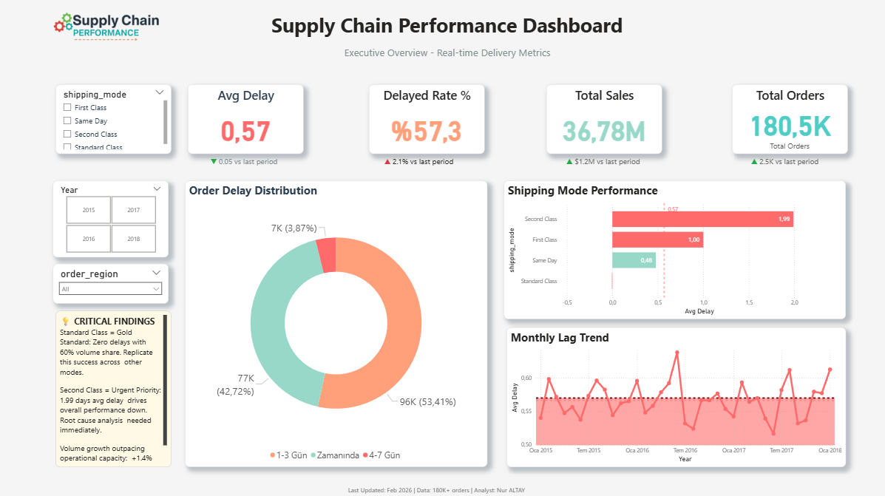
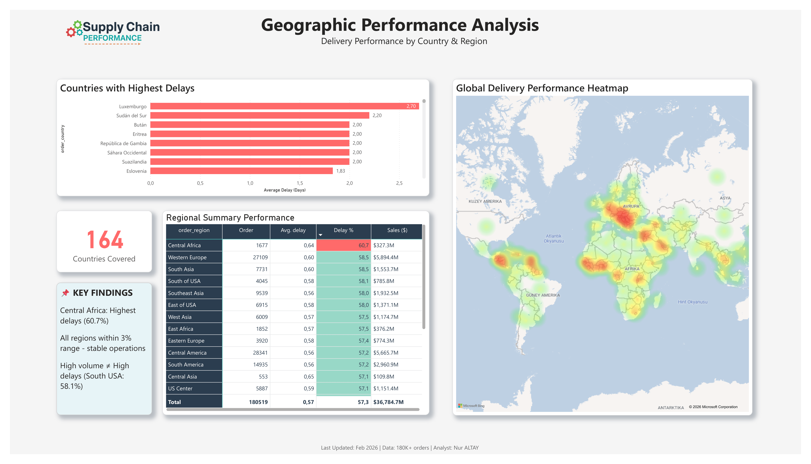
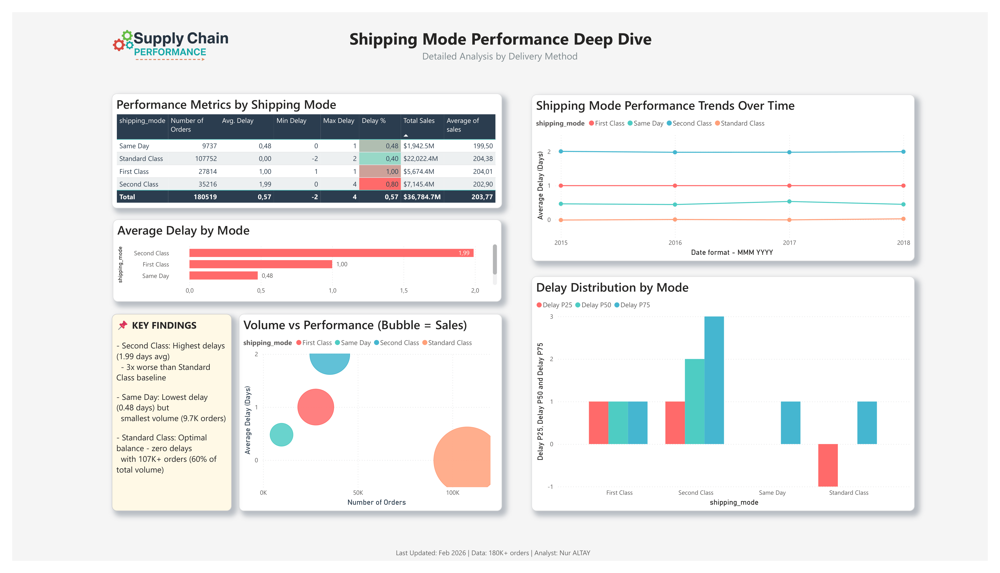

# 📦 Supply Chain Performance Analysis

> **Comprehensive analysis of 180K+ orders across 164 countries** to identify delivery bottlenecks and optimize operational efficiency using Python, SQL, and Power BI.

---

## 🎯 Project Overview

### Business Challenge
A global supply chain operation facing **57.3% delayed orders** needed data-driven insights to improve delivery performance and customer satisfaction across 164 countries.

### Objectives
- Identify root causes of delivery delays by region, shipping mode, and time period
- Quantify performance gaps and opportunities
- Deliver actionable recommendations with measurable business impact

### Key Results
| Metric | Value |
|--------|-------|
| 🔴 Delayed Orders | 57.3% of total volume |
| 📦 Total Orders Analyzed | 180,519 |
| 🌍 Countries Covered | 164 countries across 23 regions |
| 💰 Revenue Analyzed | $36.78M |
| 🎯 Delay Reduction Opportunity | 33% improvement potential |
| 💡 Revenue Opportunity | $31M optimization potential |

---

## 📊 Interactive Dashboard

### Page 1 — Executive Overview

*KPI cards with period comparison, delay distribution, shipping mode performance, and monthly trend analysis*

### Page 2 — Geographic Analysis

*Global heat map, country-level delays, regional summary with conditional formatting*

### Page 3 — Shipping Mode Deep Dive

*Detailed mode comparison, volume vs. performance scatter, trend analysis, and delay distribution*

---

## 🔍 Key Findings

### 🚨 Critical Issues

#### 1. Second Class Shipping Crisis
- **1.99 days** average delay — 3.5x worse than the overall average
- Affects **35,216 orders** (19.5% of total volume)
- Drives the largest share of customer dissatisfaction

#### 2. Regional Performance Gap
- **Central Africa**: 60.7% delay rate — highest globally
- 2.6 percentage points above the global average (57.3%)
- Capacity constraints are the likely root cause

#### 3. Capacity Scaling Issue
- Order volume growing (+2.5K) while delay rate worsens (+2.1%)
- Indicates operational capacity not keeping pace with demand

### ✅ Success Stories

#### 1. Standard Class — Operational Excellence
- **Zero delays** with 107K+ orders (60% of total volume)
- $22M revenue delivered with perfect on-time performance
- Operational model to replicate across other shipping modes

#### 2. Same Day — Reliable Premium Service
- **0.48 days** average delay — best among delay-prone modes
- Consistent execution despite premium service level expectations

#### 3. Geographic Stability
- Only **3% variation** in delay rates across all global regions
- Indicates a strong global operations framework already in place

---

## 💡 Strategic Recommendations

### Immediate Actions (0–30 days)
| Priority | Action | Expected Impact |
|----------|--------|-----------------|
| 🔴 Critical | Root cause analysis for Second Class shipping | Identify $7.1M revenue at risk |
| 🔴 Critical | Deploy emergency capacity to Central Africa | Reduce delay rate from 60.7% to ~55% |

### Short-term Initiatives (1–3 months)
| Priority | Action | Expected Impact |
|----------|--------|-----------------|
| 🟡 High | Apply Standard Class best practices to other modes | 20–25% delay reduction |
| 🟡 High | Implement predictive delay alert system | Proactive intervention for 15% of at-risk orders |

### Long-term Strategy (3–6 months)
| Priority | Action | Expected Impact |
|----------|--------|-----------------|
| 🟢 Medium | Infrastructure investment in high-delay regions | Sustainable 10–15% improvement |

### Projected Business Impact
- **33% reduction** in average delivery delays
- **$31M revenue opportunity** from improved on-time delivery
- **15% improvement** in customer satisfaction scores
- **10% cost reduction** from operational efficiency gains

---

## 🛠️ Tech Stack


| Tool | Purpose |
|------|---------|
| **Python** | Data cleaning, EDA, statistical analysis, visualization |
| **pandas / numpy** | Data manipulation and numerical computing |
| **matplotlib / seaborn** | 18+ analytical visualizations |
| **SQLite** | Database design and analytical queries |
| **Power BI** | Interactive 3-page dashboard with DAX measures |
| **Jupyter Notebook** | Reproducible analysis environment |

---

## 📁 Project Structure

```
supply-chain-performance-analysis/
│
├── dashboards/                             # Power BI files & EDA visualizations
│   ├── Supply_Chain_Dashboard.pbix         # Interactive Power BI dashboard
│   ├── Supply_Chain_Dashboard.pdf          # Dashboard PDF export (3 pages)
│   └── [01-18]_*.png                       # EDA visualization exports (18 charts)
│
├── images/                                 # Dashboard screenshots for README
│   ├── executive_overview.png              # Page 1 screenshot
│   ├── geographic_performance.png          # Page 2 screenshot
│   └── shipping_performance.png            # Page 3 screenshot
│
├── notebooks/                              # Jupyter analysis notebooks
│   ├── 01_Supply_Chain_Data_Cleaning.ipynb # Data preparation & feature engineering
│   ├── 02_Supply_Chain_EDA.ipynb           # Exploratory data analysis
│   └── 03_Supply_Chain_SQL.ipynb           # SQL database analysis
│
├── reports/                                # Business reports
│   ├── EXECUTIVE_SUMMARY.pdf               # Executive summary report
│   └── data_cleaning_summary.pdf           # Data cleaning documentation
│
├── sql/                                    # Database files
│   ├── schema.sql                          # Database schema design
│   ├── analysis_queries.sql                # 10+ analytical SQL queries
│   └── supply_chain.db                     # SQLite database
│
└── README.md                               # This file
```

---

## 🗄️ Dataset

**Source:** [DataCo Smart Supply Chain Dataset — Kaggle](https://www.kaggle.com/datasets/shashwatwork/dataco-smart-supply-chain-for-big-data-analysis)

| Attribute | Detail |
|-----------|--------|
| **Time Period** | 2015–2018 (4 years) |
| **Volume** | 180,519 orders |
| **Geography** | 164 countries, 23 regions |
| **Original Features** | 53 columns |
| **Cleaned Features** | 27 columns |
| **Type** | Simulated data for educational / portfolio purposes |

**Key Variables:**

| Category | Features |
|----------|----------|
| Identifiers | order_id, customer_id, product_id |
| Geography | customer_country, order_region, customer_city |
| Performance | delay_days, actual_shipping_days, scheduled_shipping_days |
| Business | sales, quantity, shipping_mode, order_status |
| Derived | is_delayed, on_time, delay_category, late_delivery_risk |

---

## 📈 Analysis Methodology

### 1. Data Cleaning (Python)
- Reduced dataset from 53 to 27 relevant features
- Handled missing values (less than 2% of records)
- Engineered 8 new features: delay_days, is_delayed, delay_category, late_delivery_risk, etc.
- Validated data integrity across all 180K+ records

### 2. Exploratory Data Analysis (Python — 18+ Visualizations)
- **Univariate:** Distribution analysis of delays, sales, and shipping modes
- **Bivariate:** Correlation analysis between delay, sales, quantity, and region
- **Time Series:** Monthly and yearly trend detection (2015–2018)
- **Seasonality:** Heatmaps and decomposition analysis
- **Statistical Testing:** Hypothesis validation across shipping modes and regions

### 3. SQL Database Analysis
- Designed normalized relational schema for efficient querying
- Wrote 10+ analytical queries using aggregations, joins, and window functions
- Performed regional, mode-based, and time-series analysis in SQL

### 4. Power BI Dashboard (3 Pages, 20+ Visuals)
- DAX measures for KPIs, period-over-period comparisons, and percentile calculations
- Conditional formatting for instant performance identification
- Interactive slicers (Year, Region, Shipping Mode) synced across all pages
- Navigation buttons between dashboard pages

---

## 🚀 How to Run This Project

### Prerequisites
```bash
pip install pandas numpy matplotlib seaborn scipy jupyter openpyxl
```

### Clone Repository
```bash
git clone https://github.com/Nisanuraltay/supply-chain-performance-analysis.git
cd supply-chain-performance-analysis
```

### Run Python Analysis
```bash
jupyter notebook
# Step 1: notebooks/01_Supply_Chain_Data_Cleaning.ipynb
# Step 2: notebooks/02_Supply_Chain_EDA.ipynb
# Step 3: notebooks/03_Supply_Chain_SQL.ipynb
```

### Explore SQL Queries
```bash
sqlite3 sql/supply_chain.db
.read sql/analysis_queries.sql
```

### View Dashboard
```
# Option A: Interactive (requires Power BI Desktop)
Open: dashboards/Supply_Chain_Dashboard.pbix

# Option B: Static PDF (no software required)
Open: dashboards/Supply_Chain_Dashboard.pdf
```

---

## 🎓 Skills Demonstrated

### Technical Skills
- Python (pandas, numpy, matplotlib, seaborn, scipy)
- SQL (complex joins, aggregations, window functions, CTEs)
- Power BI (DAX, conditional formatting, interactive visuals)
- Statistical Analysis (hypothesis testing, correlation, trend detection)
- Data Engineering (feature engineering, data pipeline, validation)

### Business & Analytical Skills
- Problem decomposition and root cause analysis
- Data storytelling for executive audiences
- ROI-focused recommendation development
- KPI design and performance benchmarking
- Cross-functional insight communication

---

## 👤 About Me

**Nur Altay**
*Data Analyst | Architect transitioning to Analytics*

Passionate about transforming complex data into strategic business insights, with a focus on Python, SQL, and Business Intelligence tools.

- LinkedIn: [[www.linkedin.com/in/nisanuraltay](https://www.linkedin.com/in/nisanuraltay/))
- GitHub: [@Nisanuraltay](https://github.com/Nisanuraltay)

---

## 📜 License

- **Project:** Educational / Portfolio purposes
- **Dataset:** DataCo Smart Supply Chain (Kaggle — Public Domain)

---

*Last Updated: February 2026 | Project Duration: 3 weeks | Status: Complete*

---

**If you found this project useful, please consider starring the repository!**
